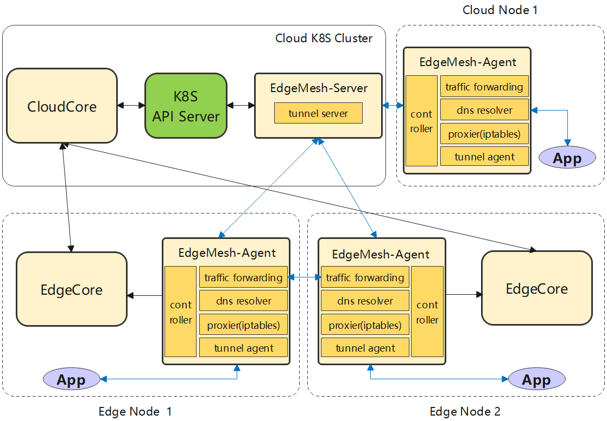

简体中文 | [English](./README.md)

# EdgeMesh

## 介绍

EdgeMesh 作为 [KubeEdge](https://github.com/kubeedge/kubeedge) 集群的数据面组件，为应用程序提供了简单的服务发现与流量代理功能，从而屏蔽了边缘场景下复杂的网络结构。

### 背景

KubeEdge 基于 [Kubernetes](https://github.com/kubernetes/kubernetes) 构建，将云原生容器化应用程序编排能力延伸到了边缘。但是，在边缘计算场景下，网络拓扑较为复杂，不同区域中的边缘节点往往网络不互通，并且应用之间流量的互通是业务的首要需求，而 EdgeMesh 正是对此提供了一套解决方案。

### 优势

EdgeMesh 满足边缘场景下的新需求（如边缘资源有限、边云网络不稳定、网络结构复杂等），即实现了高可用性、高可靠性和极致轻量化：

- **高可用性**
  - 利用 LibP2P 提供的能力，来打通边缘节点间的网络
  - 将边缘节点间的通信分为局域网内和跨局域网
    - 局域网内的通信：直接通信
    - 跨局域网的通信：打洞成功时 Agent 之间建立直连通道，否则通过 Server 中继转发
- **高可靠性 （离线场景）**
  - 元数据通过 KubeEdge 边云通道下发，无需访问云端 apiserver
  - EdgeMesh 内部集成轻量的节点级 DNS 服务器，服务发现不依赖云端 CoreDNS
- **极致轻量化**
  - 每个节点有且仅有一个 Agent，节省边缘资源

**用户价值**

- 使用户具备了跨越不同局域网边到边/边到云/云到边的应用互访能力
- 相对于部署 CoreDNS + Kube-Proxy + CNI 这一套组件，用户只需要在节点部署一个 Agent 就能完成目标

### 关键功能

<table align="center">
  <tr>
    <th align="center">功能</th>
    <th align="center">子功能</th>
    <th align="center">实现度</th>
  </tr>
  <tr>
    <td align="center">服务发现</td>
    <td align="center">/</td>
    <td align="center">✓</td>
  </tr>
  <tr>
    <td rowspan="5" align="center">流量治理</td>
    <td align="center">HTTP</td>
    <td align="center">✓</td>
  </tr>
  <tr>
    <td align="center">TCP</td>
    <td align="center">✓</td>
  </tr>
  <tr>
    <td align="center">Websocket</td>
    <td align="center">✓</td>
  </tr>
  <tr>
    <td align="center">HTTPS</td>
    <td align="center">✓</td>
  </tr>
  <tr>
    <td align="center">UDP</td>
    <td align="center">✓</td>
  </tr>
  <tr>
    <td rowspan="3" align="center">负载均衡</td>
    <td align="center">随机</td>
    <td align="center">✓</td>
  </tr>
  <tr>
    <td align="center">轮询</td>
    <td align="center">✓</td>
  </tr>
  <tr>
    <td align="center">会话保持</td>
    <td align="center">✓</td>
  </tr>
  <tr>
    <td rowspan="2" align="center">边缘网关</td>
    <td align="center">外部访问</td>
    <td align="center">✓</td>
  </tr>
  <tr>
    <td align="center">多网卡监听</td>
    <td align="center">✓</td>
  </tr>
  <tr>
    <td rowspan="2" align="center">跨子网通信</td>
    <td align="center">跨边云通信</td>
    <td align="center">✓</td>
  </tr>
  <tr>
    <td align="center">跨局域网边边通信</td>
    <td align="center">✓</td>
  </tr>
  <tr>
    <td align="center">边缘CNI</td>
    <td align="center">跨子网Pod通信</td>
    <td align="center">+</td>
  </tr>
</table>

**注：**

- `✓` EdgeMesh 版本所支持的功能
- `+` EdgeMesh 版本不具备的功能，但在后续版本中会支持
- `-` EdgeMesh 版本不具备的功能，或已弃用的功能

## 架构

上图展示了 EdgeMesh 的简要架构，EdgeMesh 包含两个微服务：edgemesh-server 和 edgemesh-agent。

edgemesh-server 的核心组件包括：

- **Tunnel-Server**: 基于 [LibP2P](https://github.com/libp2p/go-libp2p) 实现，与 edgemesh-agent 建立连接，为edgemesh-agent 提供中继能力和打洞能力

edgemesh-agent 的核心组件包括：

- **Proxier**: 负责配置内核的 iptables 规则，将请求拦截到 EdgeMesh 进程内
- **DNS**: 内置的 DNS 解析器，将节点内的域名请求解析成一个服务的集群 IP
- **Traffic**: 基于 Go-Chassis 框架的流量转发模块，负责转发应用间的流量
- **Controller**: 通过 KubeEdge 的边缘侧 Local APIServer 能力获取 Service、Endpoints、Pod 等元数据
- **Tunnel-Agent**: 基于 LibP2P 实现，利用中继和打洞来提供跨子网通讯的能力

## 指南

### 文档
EdgeMesh 在 [netlify.com](https://edgemesh.netlify.app/zh/) 托管相关文档，您可以根据这些文档更好地了解 EdgeMesh。

### 安装
EdgeMesh 的安装文档请参考[这里](https://edgemesh.netlify.app/zh/guide/getting-started.html)。

### 样例
样例1：[HTTP 流量转发](https://edgemesh.netlify.app/zh/guide/test-case.html#http)

样例2：[HTTPS 流量转发](https://edgemesh.netlify.app/zh/guide/test-case.html#https)

样例3：[TCP 流量转发](https://edgemesh.netlify.app/zh/guide/test-case.html#tcp)

样例4：[Websocket 流量转发](https://edgemesh.netlify.app/zh/guide/test-case.html#websocket)

样例5：[UDP 流量转发](https://edgemesh.netlify.app/zh/guide/test-case.html#udp)

样例6：[负载均衡](https://edgemesh.netlify.app/zh/guide/test-case.html#负载均衡)

样例7：[跨边云通信](https://edgemesh.netlify.app/zh/guide/test-case.html#跨边云通信)

## 联系方式

如果您需要支持，请从 '操作指导' 开始，然后按照我们概述的流程进行操作。

如果您有任何疑问，请通过 [KubeEdge官网](https://github.com/kubeedge/kubeedge#contact) 推荐的联系方式与我们联系

## 贡献
如果你对EdgeMesh有兴趣，希望可以为EdgeMesh做贡献，请阅读 [CONTRIBUTING](./CONTRIBUTING.md) 文档获取详细的贡献流程指导。
